* Table of Contents
{:toc}

--------------------------------------------------------------------------------------------------------------------

## **Acknowledgements**

* {list here sources of all reused/adapted ideas, code, documentation, and third-party libraries -- include links to the original source as well}

--------------------------------------------------------------------------------------------------------------------

## **Setting up, getting started**

Refer to the guide [_Setting up and getting started_](SettingUp.md).

--------------------------------------------------------------------------------------------------------------------

## **Design**

:bulb: **Tip:** The `.puml` files used to create diagrams in this document can be found in the [diagrams](https://github.com/se-edu/addressbook-level3/tree/master/docs/diagrams/) folder. Refer to the [_PlantUML Tutorial_ at se-edu/guides](https://se-education.org/guides/tutorials/plantUml.html) to learn how to create and edit diagrams.

### Architecture

The ***Architecture Diagram*** given above explains the high-level design of the App.

Given below is a quick overview of main components and how they interact with each other.

**Main components of the architecture**

**`Main`** has two classes called [`Main`](https://github.com/se-edu/addressbook-level3/tree/master/src/main/java/seedu/address/Main.java) and [`MainApp`](https://github.com/se-edu/addressbook-level3/tree/master/src/main/java/seedu/address/MainApp.java). It is responsible for,
* At app launch: Initializes the components in the correct sequence, and connects them up with each other.
* At shut down: Shuts down the components and invokes cleanup methods where necessary.

[**`Commons`**](#common-classes) represents a collection of classes used by multiple other components.

The rest of the App consists of four components.

* [**`UI`**](#ui-component): The UI of the App.
* [**`Logic`**](#logic-component): The command executor.
* [**`Model`**](#model-component): Holds the data of the App in memory.
* [**`Storage`**](#storage-component): Reads data from, and writes data to, the hard disk.

**How the architecture components interact with each other**

The *Sequence Diagram* below shows how the components interact with each other for the scenario where the user issues the command `delete 1`.

Each of the four main components (also shown in the diagram above),

* defines its *API* in an `interface` with the same name as the Component.
* implements its functionality using a concrete `{Component Name}Manager` class (which follows the corresponding API `interface` mentioned in the previous point.

For example, the `Logic` component defines its API in the `Logic.java` interface and implements its functionality using the `LogicManager.java` class which follows the `Logic` interface. Other components interact with a given component through its interface rather than the concrete class (reason: to prevent outside component's being coupled to the implementation of a component), as illustrated in the (partial) class diagram below.

The sections below give more details of each component.

### UI component

The **API** of this component is specified in [`Ui.java`](https://github.com/se-edu/addressbook-level3/tree/master/src/main/java/seedu/address/ui/Ui.java)

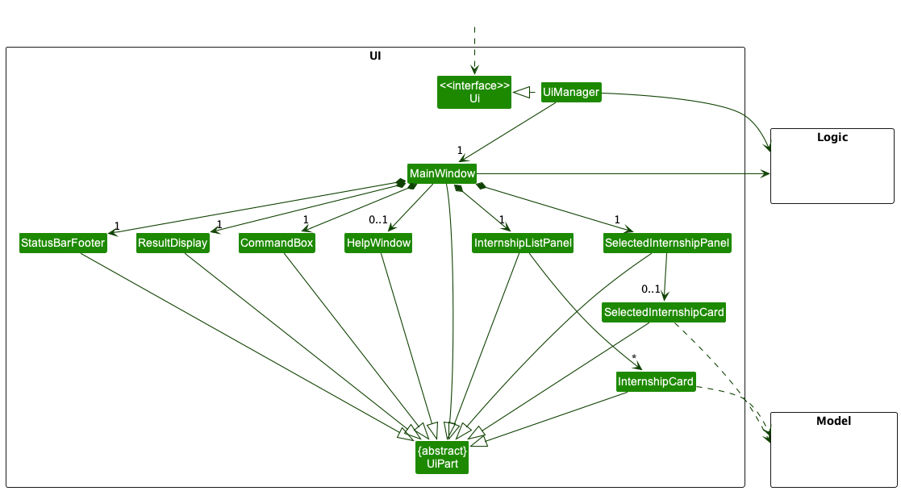

The UI consists of a `MainWindow` that is made up of parts e.g.`CommandBox`, `ResultDisplay`, `InternshipListPanel`, `StatusBarFooter` etc. All these, including the `MainWindow`, inherit from the abstract `UiPart` class which captures the commonalities between classes that represent parts of the visible GUI.

The `UI` component uses the JavaFx UI framework. The layout of these UI parts are defined in matching `.fxml` files that are in the `src/main/resources/view` folder. For example, the layout of the [`MainWindow`](https://github.com/se-edu/addressbook-level3/tree/master/src/main/java/seedu/address/ui/MainWindow.java) is specified in [`MainWindow.fxml`](https://github.com/se-edu/addressbook-level3/tree/master/src/main/resources/view/MainWindow.fxml)

The `UI` component,

* executes user commands using the `Logic` component.
* listens for changes to `Model` data so that the UI can be updated with the modified data.
* keeps a reference to the `Logic` component, because the `UI` relies on the `Logic` to execute commands.
* depends on some classes in the `Model` component, as it displays `Internship` object residing in the `Model`.

### Logic component

**API** : [`Logic.java`](https://github.com/se-edu/addressbook-level3/tree/master/src/main/java/seedu/address/logic/Logic.java)

Here's a (partial) class diagram of the `Logic` component:

How the `Logic` component works:
1. When `Logic` is called upon to execute a command, it uses the `InTrackParser` class to parse the user command.
1. This results in a `Command` object (more precisely, an object of one of its subclasses e.g., `AddCommand`) which is executed by the `LogicManager`.
1. The command can communicate with the `Model` when it is executed (e.g. to add an internship).
1. The result of the command execution is encapsulated as a `CommandResult` object which is returned back from `Logic`.

The Sequence Diagram below illustrates the interactions within the `Logic` component for the `execute("delete 1")` API call.

:information_source: **Note:** The lifeline for `DeleteCommandParser` should end at the destroy marker (X) but due to a limitation of PlantUML, the lifeline reaches the end of diagram.

Here are the other classes in `Logic` (omitted from the class diagram above) that are used for parsing a user command:

How the parsing works:
* When called upon to parse a user command, the `InTrackParser` class creates an `XYZCommandParser` (`XYZ` is a placeholder for the specific command name e.g., `AddCommandParser`) which uses the other classes shown above to parse the user command and create a `XYZCommand` object (e.g., `AddCommand`) which the `InTrackParser` returns back as a `Command` object.
* All `XYZCommandParser` classes (e.g., `AddCommandParser`, `DeleteCommandParser`, ...) inherit from the `Parser` interface so that they can be treated similarly where possible e.g, during testing.

### Model component
**API** : [`Model.java`](https://github.com/se-edu/addressbook-level3/tree/master/src/main/java/seedu/address/model/Model.java)

The `Model` component,

* stores the internship application data i.e., all `Internship` objects (which are contained in a `UniqueInternshipList` object).
* stores the currently 'selected' `Internship` objects (e.g., results of a search query) as a separate _filtered_ list which is exposed to outsiders as an unmodifiable `ObservableList<Internship>` that can be 'observed' e.g. the UI can be bound to this list so that the UI automatically updates when the data in the list change.
* stores a `UserPref` object that represents the user’s preferences. This is exposed to the outside as a `ReadOnlyUserPref` objects.
* does not depend on any of the other three components (as the `Model` represents data entities of the domain, they should make sense on their own without depending on other components)

:information_source: **Note:** An alternative (arguably, a more OOP) model is given below. It has a `Tag` list in the `InTrack`, which `Internship` references. This allows `InTrack` to only require one `Tag` object per unique tag, instead of each `Internship` needing their own `Tag` objects. 

### Storage component

**API** : [`Storage.java`](https://github.com/se-edu/addressbook-level3/tree/master/src/main/java/seedu/address/storage/Storage.java)

The `Storage` component,
* can save both internship application data and user preference data in json format, and read them back into corresponding objects.
* inherits from both `InTrackStorage` and `UserPrefStorage`, which means it can be treated as either one (if only the functionality of only one is needed).
* depends on some classes in the `Model` component (because the `Storage` component's job is to save/retrieve objects that belong to the `Model`)

### Common classes

Classes used by multiple components are in the `seedu.intrack.commons` package.

--------------------------------------------------------------------------------------------------------------------

## **Implementation**

This section describes some noteworthy details on how certain features are implemented.

### Add internship application feature

#### About this feature

The add internship application feature allows users to quickly add an internship application in the tracker via the
The add internship application feature allows users to quickly add an internship application in the tracker via the
command `add c/COMPANY p/POSITION e/EMAIL w/WEBSITE s/SALARY [t/TAG]...`.

#### How it is implemented

The `add` command is facilitated by the `AddCommand` and the `AddCommandParser`. It uses the `ArgumentTokenizer#tokenize(String argString, Prefix... prefixes)`
to extract the relevant inputs for each field. A new `Internship` object is then created with the corresponding company name, position, email, website, salary and tag.
The status field, by default, will be set to `Progress`. The `InTrack#addInternship(Internship target)` which is exposed in the `Model` interface as
`Model#addInternship(Internship target, Internship editedInternship)` is called to add the new `Internship` object to the list of internship applications.

#### Parsing user input

1. The user inputs the `add` command.
2. The `InTrackParser` processes the input and creates a new `AddCommandParser`.
3. The `AddCommandParser` then calls `ArgumentTokenizer#tokenize(String argString, Prefix... prefixes)` to extract the relevant inputs for each field.
   If any prefix is absent but compulsory or invalid, a `ParseException` would be thrown.
4. The respective `Name`, `Position`, `Email`, `Website`, `Salary` and `Tag` constructors then check for the validity of parsed inputs.
   If any of the parsed inputs are absent but compulsory or invalid, a `ParseException` would be thrown.
5. The `AddCommandParser` then creates the `AddCommand` based on the processed input.

#### Command execution

1. The `LogicManager` executes the `AddCommand`.
2. The `AddCommand` then creates a new `Internship` object with the corresponding parsed inputs for each field.
3. The `AddCommand` then calls `InTrack#addInternship(Internship target, Internship editedInternship)` to add the
   new `Internship` object to the list of internship applications.

#### Displaying of result

1. Finally, the `AddCommand` creates a `CommandResult` with a success message and returns it to the `LogicManager`
   to complete the command execution. The GUI would also be updated with the change of status.

The following sequence diagram shows how the `add` command works:

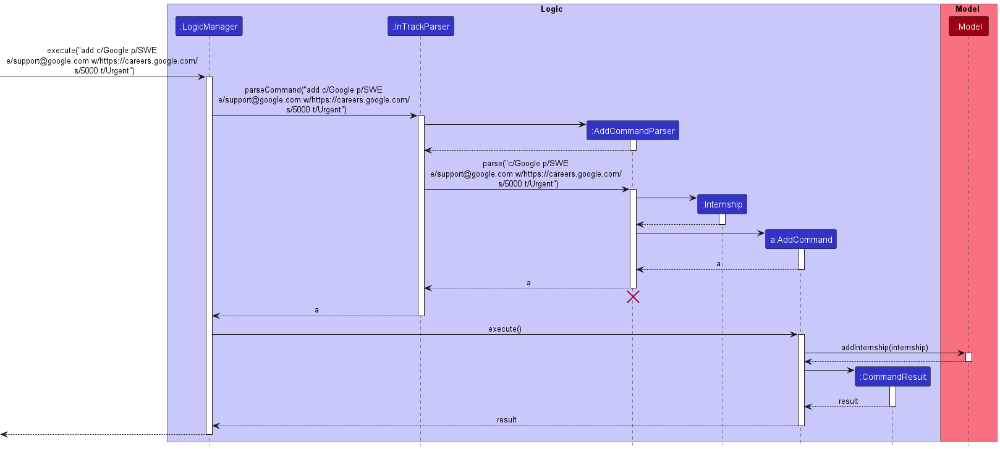

The following activity diagram shows what happens when a user executes a `add` command:

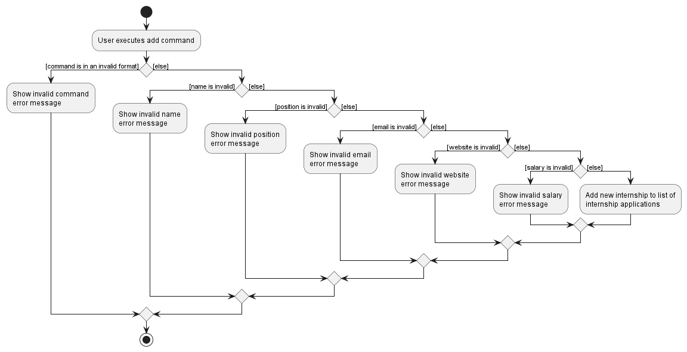

#### Design considerations

**Aspect: Command to add status of an internship application**
Most internship applications added by users would still be in progress, so a default "Progress" status is provided for
each new `Internship` instead of requiring the user to provide one initially, saving time. As such, there is no need for
a prefix for the `Status` field.

### Update internship application status feature

#### About this feature

The update internship application status feature allows users to quickly update the status of an internship application
in the tracker via the command `status INDEX STATUS`, where `INDEX` must be a positive integer within the list and
`STATUS` must be either `o` (for **O**ffered), `p` (for in **P**rogress) or `r` (for **R**ejected).

#### How it is implemented

The `status` command is facilitated by the `StatusCommand` and the `StatusCommandParser`. It uses the `List#get(int index)`
on the list of internship applications returned from the `Model#getFilteredInternshipList()` to get the target `Internship`
object to be updated. A new `Internship` object is then created with the new status. The
`InTrack#setInternship(Internship target, Internship editedInternship)` which is exposed in the `Model` interface as
`Model#setInternship(Internship target, Internship editedInternship)` is called to replace the target `Internship` object
with the updated one.

#### Parsing user input

1. The user inputs the `status` command.
2. The `InTrackParser` processes the input and creates a new `StatusCommandParser`.
3. The `StatusCommandParser` then calls `ParserUtil#parseIndex(String oneBasedIndex)` to check for the validity of INDEX.
If `INDEX` is absent or invalid, a `ParseException` would be thrown.
4. The `StatusCommandParser` then checks for the validity of STATUS. If `STATUS` is absent or invalid, a `ParseException`
would be thrown.
5. The `StatusCommandParser` then creates the `StatusCommand` based on the processed input.

#### Command execution

1. The `LogicManager` executes the `StatusCommand`.
2. The `StatusCommand` calls the `Model#getFilteredPersonList()` and `List#get(int index)` to get the target `Internship`
object to be updated based on the provided `INDEX`.
3. The `StatusCommand` then creates a new `Internship` object with the same variables as the target one except with the
new status.
4. The `StatusCommand` then calls `InTrack#setInternship(Internship target, Internship editedInternship)` to replace the
target `Internship` object with the updated one.

#### Displaying of result

1. Finally, the `StatusCommand` creates a `CommandResult` with a success message and returns it to the `LogicManager`
to complete the command execution. The GUI would also be updated with the change of status.

The following sequence diagram shows how the `status` command works:

The following activity diagram shows what happens when a user executes a `status` command:

#### Design considerations

**Aspect: Command to update status of an internship application**

Most internship applications added by users would still be in progress, so a default "Progress" status is provided for
each new `Internship` instead of requiring the user to provide one initially, saving time. As such, there is no need for
a prefix for the `Status` field and the `edit` command will not work in this case. Having a separate `status` command
allows for the format to be kept short and simple which further increases the ease of updating the status of internship
applications.

### Add internship application task feature

#### About this feature

The add internship application task feature allows users to add a task associated to an internship application
in the tracker via the command `addtask INDEX TASKNAME /at TASKTIME`, where `INDEX` must be a positive integer within
the list, `TASKNAME` must not be an empty string, and `TASKTIME` must be in the format `dd-MM-yyyy HH:mm`.

#### How it is implemented

The `addtask` command is facilitated by the `AddTaskCommand` and `AddTaskCommandParser`. It uses the
`List#get(int index)` on the list of internship applications returned from the `Model#getFilteredInternshipList()` to
get the target `Internship` object to be updated. A new `Internship` object is then created with the new `Task` updated
in the `List<Task>`. The `InTrack#setInternship(Internship target, Internship editedInternship)` which is exposed in the
`Model` interface as `Model#setInternship(Internship target, Internship editedInternship)` is called to replace the
target `Internship` object with the updated one.

#### Parsing user input

1. The user inputs the `addtask` command.
2. The `InTrackParser` processes the input and creates a new `AddTaskCommandParser`.
3. The `AddTaskCommandParser` then calls `ParserUtil#parseIndex(String oneBasedIndex)` to check for the validity of
`INDEX`. If `INDEX` is absent or invalid, a `ParseException` would be thrown.
4. The `AddTaskCommandParser` then checks for the validity of `TASKNAME` and `TASKTIME`. If either `TASKNAME` or
`TASKTIME` is absent or invalid, a `ParseException` would be thrown.
5. The `AddTaskCommandParser` then creates the `AddTaskCommand` based on the processed input.

#### Command execution

1. The `LogicManager` executes the `AddTaskCommand`.
2. The `AddTaskCommand` calls the `Model#getFilteredPersonList()` and `List#get(int index)` to get the target `Internship`
   object to be updated based on the provided `INDEX`.
3. The `AddTaskCommand` then creates a new `Internship` object with the same variables as the target and adds the new
task to the `List<Task>`.
4. The `AddTaskCommand` then calls `InTrack#setInternship(Internship target, Internship editedInternship)` to replace the
   target `Internship` object with the updated one.

#### Displaying of result

1. Finally, the `AddTaskCommand` creates a `CommandResult` with a success message and returns it to the `LogicManager`
   to complete the command execution. The GUI would also be updated with the new task added.

The following sequence diagram shows how the `addtask` command works:
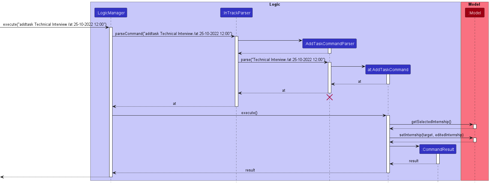

The following activity diagram shows what happens when a user executes a `addtask` command:
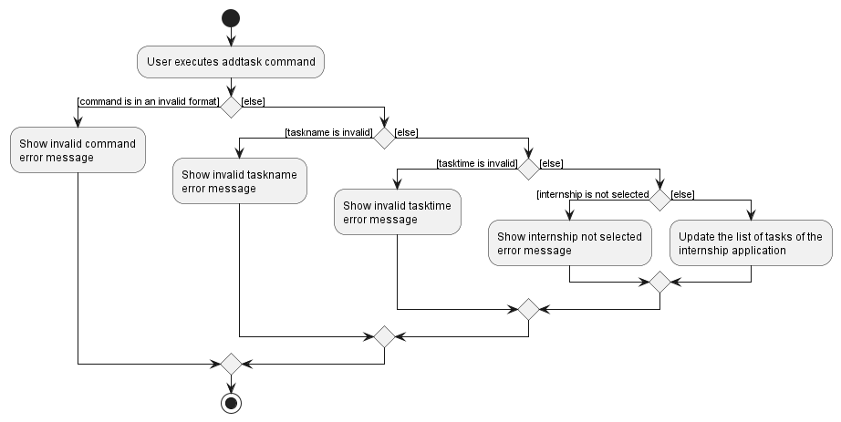

### Add internship remark feature

#### About this feature
The add internship remark feature allows users to add a remark to his/her internship interview information via the command
`remark` `INDEX` `r/`.

#### How it is implemented
The implemented `remark` command is facilitated by `RemarkCommand` and `RemarkCommandParser`. It enables users to add a Remark to their internship information.
It uses the `get(int INDEX)` on the list of internships received from `getFilteredInternshipList()` which is exposed to the `Model` interface as `Model#getFilteredInternshipList()` to
get an Internship Object. A new Internship object is then created with the new remark. Then the`InTrack#setInternship(Internship target, Internship editedInternship)` which is exposed in the Model interface as
`Model#setInternship(Internship target, Internship editedInternship)`, is used to replace the old Internship panel with the new one.

Given below is how the remark mechanism behaves at each step.

#### Parsing User input
Step 1. The user inputs the `remark` command  and provide the `INDEX` of the internship the user wants to add the remark to, the `r/` prefix and finally the `REMARK_CONTENT`
that he/she wants to add.

Step 2. The 'InTrackParser' then parses the user input and checks if the command word and arguments are correct before creating a new
`RemarkCommandParser`.

Step 3. The `RemarkCommandParser` then parses the user input and checks if the input variables are correct by checking for the presence of
the prefixes. It also checks whether the command is in the correct format. The correct format of the input is `r/REMARK_CONTENT`.

A `ParseException` will be thrown if the format is incorrect.

Step 4. If the format is correct, `RemarkCommandParser` will create a `RemarkCommand` based on the given inputs.

#### Command execution

Step 5. The `LogicManager` executes the `RemarkCommand`.

Step 6. The `RemarkCommand` obtains a list of `Internship`s via the `getFilteredInternshipList()` method
which is exposed to the `Model` interface as `Model#getFilteredInternshipList()`

Step 7. The `RemarkCommand` obtains the `Internship` object that the user wants to add the remark to via the
`get(int INDEX)` method from list of `Internship`s.

Step 8. The `RemarkCommand` then creates a new `Internship` object with the same variables as the old `Internship` except for the
`REMARK_CONTENT` that the user has input.

Step 9. `RemarkCommand` then call the `Model#setInternship(internshipToEdit, editedInternship)` to replace the old `Internship` with the new `Internship` with the new `Remark`

#### Displaying of result

Step 10. Finally, the `RemarkCommand` creates a `CommandResult` with a success message and returns it to the `LogicManager` to complete the command execution. The
GUI would also be updated on this change in the internship list and update the display of the `Internship` respectively.

The following sequence diagram shows how the `remark` command works:

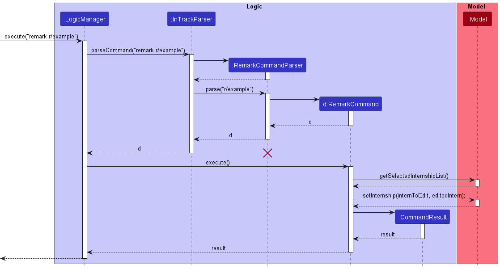

The following activity diagram summarises what happens when a user executes the `remark` command:

#### Design considerations

**Aspect: Command to add remark to an internship application**
When a user has just added an internship application, he probably has not been to the internship interview yet,
so he would not have any remarks or notes to take about the interview process yet. Thus, the default `remark` field will
be empty for each new `Internship` instead of requiring the user to provide one initially, saving time.

### Find internship application by company name feature

#### About this feature

The find internship application by company name feature allows users to query the list of added internship applications
for applications that match the desired company name via the command `findn COMPANYNAME`, where `COMPANYNAME` must not
be an empty string.

#### How it is implemented

The `findn` command is facilitated by the `FindNameCommand`, `FindNameCommandParser` and the `NameContainsKeywordsPredicate`.
It uses `Model#updateFilteredInternshipList(Predicate<Internship> predicate)` to apply the `NameContainsKeywordsPredicate`
in order to produce a filtered list containing only entries whose names correspond to `COMPANYNAME`.

#### Parsing user input

1. The user inputs the `findn` command.
2. The `InTrackParser` processes the input and creates a new `FindNameCommandParser`.
3. The `FindNameCommandParser` then trims the input to remove whitespace. If the input is an empty string, a `ParseException`
would be thrown.
4. The `FindNameCommandParser` then creates the new `FindNameCommand` based on the processed input.

#### Command execution

1. The `LogicManager` executes the `FindNameCommand`.
2. The `FindNameCommand` calls the `Model#updateFilteredInternshipList(Predicate<Internship> predicate)` to update the
current internship list to only show internship applications matching the provided `COMPANYNAME`.

#### Displaying of result

1. Finally, the `FindNameCommand` creates a `CommandResult` containing the number of matching internship applications
and returns it to the `LogicManager` to complete the command execution. The GUI would also be updated with the change in
list.

The following sequence diagram shows how the `findn` command works:
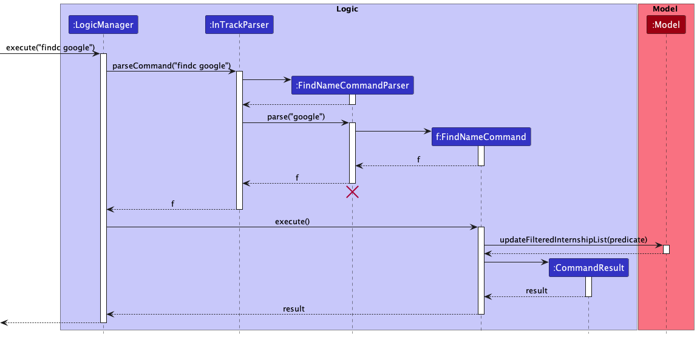

The following activity diagram shows what happens when a user executes a `findn` command:
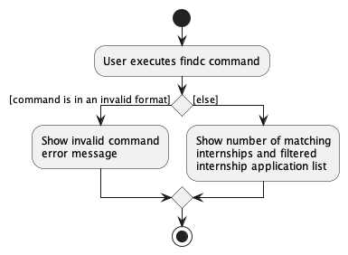

### \[Proposed\] Undo/redo feature

#### Proposed Implementation

The proposed undo/redo mechanism is facilitated by `VersionedInTrack`. It extends `InTrack` with an undo/redo history, stored internally as an `intrackStateList` and `currentStatePointer`. Additionally, it implements the following operations:

* `VersionedInTrack#commit()` — Saves the current internship tracker state in its history.
* `VersionedInTrack#undo()` — Restores the previous internship tracker state from its history.
* `VersionedInTrack#redo()` — Restores a previously undone internship tracker state from its history.

These operations are exposed in the `Model` interface as `Model#commitInTrack()`, `Model#undoInTrack()` and `Model#redoInTrack()` respectively.

Given below is an example usage scenario and how the undo/redo mechanism behaves at each step.

Step 1. The user launches the application for the first time. The `VersionedInTrack` will be initialized with the initial internship tracker state, and the `currentStatePointer` pointing to that single internship tracker state.

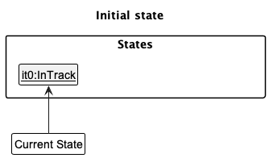

Step 2. The user executes `delete 5` command to delete the 5th internship in the internship tracker. The `delete` command calls `Model#commitInTrack()`, causing the modified state of the internship tracker after the `delete 5` command executes to be saved in the `intrackStateList`, and the `currentStatePointer` is shifted to the newly inserted internship tracker state.

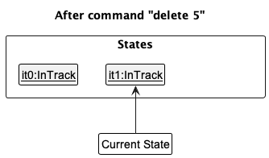

Step 3. The user executes `add c/Google …​` to add a new internship. The `add` command also calls `Model#commitInTrack()`, causing another modified internship tracker state to be saved into the `intrackStateList`.

:information_source: **Note:** If a command fails its execution, it will not call `Model#commitInTrack()`, so the internship tracker state will not be saved into the `intrackStateList`.

Step 4. The user now decides that adding the internship was a mistake, and decides to undo that action by executing the `undo` command. The `undo` command will call `Model#undoInTrack()`, which will shift the `currentStatePointer` once to the left, pointing it to the previous internship tracker state, and restores the internship tracker to that state.

:information_source: **Note:** If the `currentStatePointer` is at index 0, pointing to the initial InTrack state, then there are no previous InTrack states to restore. The `undo` command uses `Model#canUndoInTrack()` to check if this is the case. If so, it will return an error to the user rather
than attempting to perform the undo.

The following sequence diagram shows how the undo operation works:

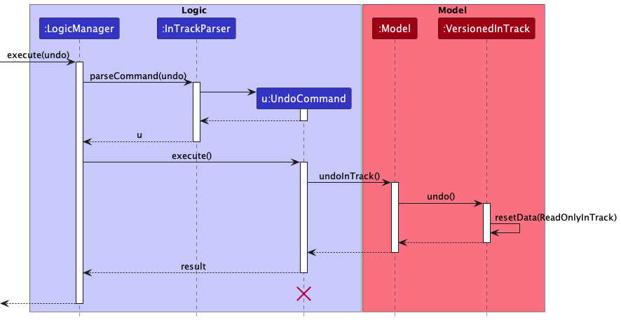

:information_source: **Note:** The lifeline for `UndoCommand` should end at the destroy marker (X) but due to a limitation of PlantUML, the lifeline reaches the end of diagram.

The `redo` command does the opposite — it calls `Model#redoInTrack()`, which shifts the `currentStatePointer` once to the right, pointing to the previously undone state, and restores the internship tracker to that state.

:information_source: **Note:** If the `currentStatePointer` is at index `intrackStateList.size() - 1`, pointing to the latest internship tracker state, then there are no undone InTrack states to restore. The `redo` command uses `Model#canRedoInTrack()` to check if this is the case. If so, it will return an error to the user rather than attempting to perform the redo.

Step 5. The user then decides to execute the command `list`. Commands that do not modify the internship tracker, such as `list`, will usually not call `Model#commitInTrack()`, `Model#undoInTrack()` or `Model#redoInTrack()`. Thus, the `intrackStateList` remains unchanged.

Step 6. The user executes `clear`, which calls `Model#commitInTrack()`. Since the `currentStatePointer` is not pointing at the end of the `intrackStateList`, all internship tracker states after the `currentStatePointer` will be purged. Reason: It no longer makes sense to redo the `add c/Google …​` command. This is the behavior that most modern desktop applications follow.

The following activity diagram summarizes what happens when a user executes a new command:

#### Design considerations:

**Aspect: How undo & redo executes:**

* **Alternative 1 (current choice):** Saves the entire internship tracker.
  * Pros: Easy to implement.
  * Cons: May have performance issues in terms of memory usage.

* **Alternative 2:** Individual command knows how to undo/redo by
  itself.
  * Pros: Will use less memory (e.g. for `delete`, just save the internship being deleted).
  * Cons: We must ensure that the implementation of each individual command are correct.

_{more aspects and alternatives to be added}_

### \[Proposed\] Data archiving

_{Explain here how the data archiving feature will be implemented}_

--------------------------------------------------------------------------------------------------------------------

## **Documentation, logging, testing, configuration, dev-ops**

* [Documentation guide](Documentation.md)
* [Testing guide](Testing.md)
* [Logging guide](Logging.md)
* [Configuration guide](Configuration.md)
* [DevOps guide](DevOps.md)

--------------------------------------------------------------------------------------------------------------------

## **Appendix: Requirements**

### Product scope

**Target user profile**:

* has a need to manage a significant number of internship applications
* prefer desktop apps over other types
* can type fast
* prefers typing to mouse interactions
* is reasonably comfortable using CLI apps

**Value proposition**:

* Manage internship applications faster than a typical mouse/GUI driven app
* Manage multiple internships and provide comparisons between them for better decision-making
* Easily customizable and personalizable to manage internships applications
* Frequent reminders for deadlines

### User stories

Priorities: High (must have) - `* * *`, Medium (nice to have) - `* *`, Low (unlikely to have) - `*`

| Priority | As a …​                                    | I want to …​                                                          | So that I can…​                                                    |
|----------|--------------------------------------------|-----------------------------------------------------------------------|--------------------------------------------------------------------|
| `* * *`  | new user                                   | see usage instructions                                                | learn how to use the App                                           |
| `* * *`  | user                                       | view a list of current internship applications                        | -                                                                  |
| `* * *`  | user                                       | add a new internship application                                      | -                                                                  |
| `* * *`  | user                                       | delete an internship application                                      | remove entries that I no longer need                               |
| `* *`    | user                                       | mark internship applications as completed                             | clearly see my progress                                            |
| `*`      | user                                       | unmark completed internship applications                              | clearly see my progress                                            |
| `* * *`  | forgetful user                             | obtain the information of the company                                 | contact them if I have any queries                                 |
| `*`      | potential user                             | see the app populated with sample data                                | see what the app is like while it is in use                        |
| `* *`    | new user                                   | purge all current data                                                | get rid of experimental data I used for exploring the app          |
| `* * *`  | organized user                             | color code tags for different interviews and statuses                 | sort and prioritize my interview data                              |
| `* *`    | user applying to many internships          | sort application deadlines by time and priority                       | take note of upcoming deadlines                                    |
| `* *`    | user applying to many internships          | record down the dates of the interviews                               | avoid interview clashes                                            |
| `* *`    | user who just started his interviews       | record my mistakes made during interviews                             | reflect on t hem                                                   |
| `* * *`  | user applying to many internships          | search for a specific company via keywords                            | easily find the information I am looking for                       |
| `* *`    | user applying to many internships          | receive reminders about upcoming interviews and deadlines             | not miss any important dates                                       |
| `* * *`  | user applying to many internships          | make my own tags                                                      | sort my applications better                                        |
| `* *`    | user applying to technical internships     | view different stages of my interview such as HR and technical stages | see what phase of the interviews I am at                           |
| `* * *`  | user applying to internships progressively | edit individual application information at any time                   | make sure the information stays relevant                           |
| `* *`    | user applying to technical internships     | filter through my internships by job role                             | to keep track of the roles I have applied for                      |
| `*`      | user applying to many internships          | sort the salaries of each company                                     | compare the options I have                                         |
| `*`      | user applying to many internships          | archive the interviews I have been rejected from                      | avoid cluttering the app with data and also refer to them later on |
| `* *`    | user applying to many internships          | prioritize the companies I am keen on                                 | compare the options I have                                         |
| `* * *`  | frequent user                              | the commands to be simple and memorable                               | access my information quickly and easily                           |
| `*`      | frequent user                              | search for applications through case sensitive searching              | find and sort my internships more easily                           |
| `* *`    | user                                       | view internship periods of different companies                        | more informed about my applications                                |
| `*`      | frequent user                              | have a customizable GUI                                               | have more visible information on my applications                   |
| `* *`    | frequent user                              | compare internship statistics such as internship lengths              | make a more informed choice                                        |
| `*`      | frequent user                              | send feedback to the developers of the application                    | make them optimize the app more                                    |

*{More to be added}*

### Use cases

(For all use cases below, the **System** is the `InTrack` and the **Actor** is the `user`, unless specified otherwise)

**Use case: UC01 - View usage instructions**

**MSS**

1. User requests to view usage instructions.

2. InTrack displays the usage instructions.

    Use case ends.

---

**Use case: UC02 - View all internship applications**

**MSS**

1. User requests to list all internship applications.

2. InTrack displays a list of all internship applications.

   Use case ends.

---

**Use case: UC03 - Add a new internship application**

**MSS**

1. User requests to add a new internship application to the list.

2. InTrack adds the new internship application.

   Use case ends.

**Extensions**

* 1a. The given command has an invalid format.

    * 1a1. InTrack shows an error message.

      Use case ends.

* 1b. The given internship application already exists in InTrack.

    * 1b1. InTrack shows an error message.

      Use case ends.
    
---

**Use case: UC04 - Delete an internship application**

**MSS**

1. User <u>views list of internship applications (UC02)</u>.

2. User requests to delete a specific internship application in the list.

3. InTrack deletes the internship application.

   Use case ends.

**Extensions**

* 2a. The given index is invalid.

    * 2a1. InTrack shows an error message.

      Use case resumes at step 2.

---

**Use case: UC05 - Update the status of an internship application**

**MSS**

1. User <u>views list of internship applications (UC02)</u>.

2. User requests to update the status of a specific internship application in the list.

3. InTrack updates the status of the internship application.

   Use case ends.

**Extensions**

* 2a. The given index is invalid.

    * 2a1. InTrack shows an error message.

      Use case resumes at step 2.

* 2b. The given status is invalid.

    * 2b1. InTrack shows an error message.

      Use case resumes at step 2.

---

**Use case: UC06 - Add a tag to an internship application**

**MSS**

1. User <u>views list of internship applications (UC02)</u>.

2. User requests to add a tag to a specific internship application in the list.

3. InTrack adds the tag to the internship application.

   Use case ends.

**Extensions**

* 2a. The given index is invalid.

    * 2a1. InTrack shows an error message.

      Use case resumes at step 2.

* 2b. The given tag is invalid.

    * 2b1. InTrack shows an error message.

      Use case resumes at step 2.

* 2c. The given tag already exists in the internship application.

    * 2c1. InTrack shows an error message.

      Use case resumes at step 2.

---

**Use case: UC07 - Delete a tag from an internship application**

**MSS**

1. User <u>views list of internship applications (UC02)</u>.

2. User requests to delete a tag from a specific internship application in the list.

3. InTrack deletes the tag from the internship application.

   Use case ends.

**Extensions**

* 2a. The given index is invalid.

    * 2a1. InTrack shows an error message.

      Use case resumes at step 2.

* 2b. The given tag is invalid.

    * 2b1. InTrack shows an error message.

      Use case resumes at step 2.

* 2c. The given tag does not exist in the internship application.

    * 2c1. InTrack shows an error message.

      Use case resumes at step 2.

---

**Use case: UC08 - Select an internship application**

**MSS**

1. User <u>views list of current internship applications (UC02)</u>.

2. User requests to select a specific internship application in the list.

3. InTrack selects the internship application and displays its full details.

   Use case ends.

**Extensions**

* 2a. The given index is invalid.

    * 2a1. InTrack shows an error message.

      Use case resumes at step 2.

---

**Use case: UC09 - Edit an internship application**

**MSS**

1. User <u>selects an internship application (UC08)</u>.

2. User requests to edit the selected internship application.

3. InTrack edits the selected internship application.

   Use case ends.

**Extensions**

* 2a. The given command has an invalid format.

    * 2a1. InTrack shows an error message.

      Use case resumes at step 2.

* 2b. The edited internship application already exists in InTrack.

    * 2b1. InTrack shows an error message.

      Use case resumes at step 2.

---

**Use case: UC10 - Add a task to an internship application**

**MSS**

1. User <u>selects an internship application (UC08)</u>.

2. User requests to add a task to the selected internship application.

3. InTrack adds the task to the selected internship application.

   Use case ends.

**Extensions**

* 2a. The given command has an invalid format.

    * 2a1. InTrack shows an error message.

      Use case resumes at step 2.

---

**Use case: UC11 - Delete a task from an internship application**

**MSS**

1. User <u>selects an internship application (UC08)</u>.

2. User requests to delete a task from the selected internship application.

3. InTrack deletes the task from the selected internship application.

   Use case ends.

**Extensions**

* 2a. The given task index is invalid.

    * 2a1. InTrack shows an error message.

      Use case resumes at step 2.

---

**Use case: UC12 - Add a remark to an internship application**

**MSS**

1. User <u>selects an internship application (UC08)</u>.

2. User requests to add a remark to the selected internship application.

3. InTrack adds the remark to the selected internship application.

   Use case ends.

---

**Extensions**

* 2a. The given command has an invalid format.

    * 2a1. InTrack shows an error message.

      Use case resumes at step 2.

---

**Use case: UC13 - Clear all internship applications**

**MSS**

1. User requests to clear all internship applications.

2. InTrack clears all internship applications. 

   Use case ends.

---

**Use case: UC14 - Find internship applications**

**MSS**

1. User requests to find internship applications.

2. InTrack finds and displays the internship applications that match the given input parameters.

   Use case ends.

---

**Use case: UC15 - Filter internship applications by status**

**MSS**

1. User requests to filter internship applications by status.

2. InTrack filters and displays the internship applications with the given status.

   Use case ends.

**Extensions**

* 1a. The given status is invalid.

    * 1a1. InTrack shows an error message.

      Use case ends.

---

**Use case: UC16 - Sort internship applications**

**MSS**

1. User requests to sort internship applications.

2. InTrack sorts the internship applications via the given parameter in the given order.

   Use case ends.

**Extensions**

* 1a. The given parameter is invalid.

    * 1a1. InTrack shows an error message.

      Use case ends.

* 1b. The given order is invalid.

    * 1b1. InTrack shows an error message.

      Use case ends.

---

**Use case: UC17 - View statistics of internship applications**

**MSS**

1. User <u>views list of internship applications (UC02)</u>.

2. User requests to view statistics of internship applications.

3. InTrack displays the statistics of the list of internship applications.

   Use case ends.

---

### Non-Functional Requirements

1. Should work on any _mainstream OS_ as long as it has Java `11` or above installed.
2. Should be able to hold up to 1000 internship applications without a noticeable sluggishness in performance for typical usage.
3. A user with above average typing speed for regular English text (i.e. not code, not system admin commands) should be able to accomplish most of the tasks faster using commands than using the mouse.
4. Data should be stored consistently upon closing and reopening the app
5. System should be usable by a Computing student who has never applied to an internship before
6. System should be easily usable by the majority of Year 2+ Computing students

*{More to be added}*

### Glossary

| Term        | Explanation |
| ----------- | ----------- |
| Mainstream OS | Windows, Linux, Unix, OS-X |
| Graphical User Interface (GUI) | An interface for the user to interact with the system via graphical icons and audio |
| Command Line Interface (CLI) | An interface for the user to input commands to interact with the system |

--------------------------------------------------------------------------------------------------------------------

## **Appendix: Instructions for manual testing**

Given below are instructions to test the app manually.

:information_source: **Note:** These instructions only provide a starting point for testers to work on;
testers are expected to do more *exploratory* testing.

### Launch and shutdown

1. Initial launch

   1. Download the jar file and copy into an empty folder

   2. Double-click the jar file  
   Expected: Shows the GUI with a set of sample internships. The window size may not be optimum.

2. Saving window preferences

   1. Resize the window to an optimum size. Move the window to a different location. Close the window.

   2. Re-launch the app by double-clicking the jar file. 
       Expected: The most recent window size and location is retained.

### Display help

Command: `help`  
More information on usage: [help command](UserGuide.html#viewing-help-help)

1. Test case: `help`  
   Expected: Help window with list of commands is displayed

### Listing all internships

Command: `list`  
More information on usage: [list command](UserGuide.html#listing-all-internship-applications--list)

1. Test case: `list`  
   Expected: Shows a list of all internship applications in InTrack.

### Viewing statistics

Command: `stats`  
More information on usage: [stats command](UserGuide.html#viewing-statistics-of-internship-applications-stats)

1. Test case: `stats`  
   Expected: Statistics of the current list of internship applications are displayed, showing the number of offered, in 
   progress and rejected applications.

### Exiting application

Command: `exit`  
More information on usage: [exit command](UserGuide.html#exiting-the-program-exit)

1. Test case: `exit`  
   Expected: Exits InTrack and all data is saved.

### Adding an internship

Command: `add`  
More information on usage: [add command](UserGuide.html#adding-an-internship-application-add)

1. Adding an internship application while all internship applications are being shown.

    1. Prerequisites: List all internship applications using the `list` command. 
   
    2. Test case: `add c/Google p/SWE e/hr@google.com w/https://careers.google.com/ s/5000 t/Urgent` 
    Expected: An internship application with the company `Google` with the following attributes are added to the 
    internship applications list. The new internship is added to the last index of the internship list. The new 
    internship application card appeared at the bottom of the list. The details of the newly added internship is shown
    in the success message.
   
    3. Test case: `add c/Google p/Data Analyst e/hr@google.com w/https://careers.google.com/ s/5000 t/Urgent` 
    Expected: An internship application with the company `Google` with the following attributes are added to the
    internship applications list. Note that the `COMPANY` of this internship is that same as the test case above. 
    However, the new internship's `POSIITON` is different. The new internship is added to the last index of the 
    internship list. The new internship application card appeared at the bottom of the list. The details of the newly 
    added internship is shown in the success message.
   
    4. Test case: `add c/Google` 
    Expected: No internship application added. Error details shown in error message.
    
    5. Other incorrect add commands to try: `add`, `add c/Google p/Data Analyst` 
    Expected: Similar to previous.

### Deleting an internship

Command: `delete`  
More information on usage: [delete command](UserGuide.html#deleting-an-internship-application-delete)

1. Deleting an internship while all internships are being shown

    1. Prerequisites: List all internships using the `list` command. Multiple internships in the list.

    2. Test case: `delete 1` 
       Expected: First internship is deleted from the list. Details of the deleted internship is shown in the success 
       message. 

    3. Test case: `delete 0` 
        Expected: No internship is deleted. Error details shown in the error message.

    4. Other incorrect delete commands to try: `delete`, `delete x` (where x is larger than the list size) 
       Expected: Similar to previous.

1. Deleting an internship while internships are being filtered.

    1. Prerequisites: Filter the internship list using either `findc`, `findp` or `findt` command. Multiple internships in the list.

    2. Test case: Similar to previous 
    Expected: Similar to previous

### Updating status of an internship

Command: `status`  
More information on usage: [status command](UserGuide.html#updating-status-of-an-internship-application--status)

1. Updating status of an internship while all internships are shown.

    1. Prerequisites: List all internships using the `list` command. Multiple internships in the list.

    2. Test case: `status 1 o` 
       Expected: First internship's status is set to `Offered` which is displayed as green on the internship card.

    3. Test case: `status 0 o` 
       Expected: No internship status is changed. Error details shown in the error message.

    4. Other incorrect status commands to try: `status 1 j`, `status x o` (where x is larger than the list size) 
       Expected: Similar to previous.

2. Updating status of an internship while internships are being filtered.

   1. Prerequisites: Filter the internship list using either `findc`, `findp` or `findt` command. Multiple internships in the list.

   2. Test case: Similar to previous 
      Expected: Similar to previous

### Adding tags to an internship

Command: `addtag`  
More information on usage: [addtag command](UserGuide.html#adding-a-tag-to-an-internship-application--addtag)

1. Adding tags to an internship while all internships are shown.

    1. Prerequisites: List all internships using the `list` command. Multiple internships in the list. The first 
       internship in the list has only the `Urgent` tag (case-sensitive).

    2. Test case: `addtag 1 Remote` 
        Expected: `Remote` tag is added to the first internship. 

    3. Test case: `addtag 1 Urgent Remote` 
       Expected: `Remote` tag is added to the first internship.
   
    4. Test case: `addtag 1 Important Remote` 
       Expected: `Important` and `Remote` tags are both added to the first internship.
       
    5. Test case: `addtag 1 Urgent` 
       Expected: No tags are added to any internship. Success message is shown.
   
    6. Test case: `addtag 0 Urgent` 
       Expected: No tags are added to any internship. Error details shown in the error message.

    7. Other incorrect addtag commands to try: `addtag 1`, `addtag x Urgent` (where x is larger than the list size) 
       Expected: Similar to previous.

2. Adding tags to an internship while internships are being filtered.

    1. Prerequisites: Filter the internship list using either `findc`, `findp` or `findt` command. Multiple 
       internships in the list. The first internship in the list has only the `Urgent` tag (case-sensitive).

    2. Test case: Similar to previous 
       Expected: Similar to previous

### Deleting tags from an internship

Command: `deltag`  
More information on usage: [deltag command](UserGuide.html#deleting-a-tag-from-an-internship-application--deltag)

1. Deleting tags from an internship while all internships are shown.

    1. Prerequisites: List all internships using the `list` command. Multiple internships in the list. The first
       internship in the list has only the `Urgent` tag (case-sensitive).

    2. Test case: `deltag 1 Urgent` 
       Expected: The `Urgent` tag is deleted from the first internship in the list.

    3. Test case: `deltag 1 Urgent Remote` 
       Expected: No tags are deleted from the any internship. Error details shown in error message.

    4. Test case: `deltag 0 Urgent` 
       Expected: No tags are added to any internship. Error details shown in the error message.

    5. Other incorrect status commands to try: `deltag 1`, `deltag x Urgent` (where x is larger than the list size) 
       Expected: Similar to previous.

2. Deleting tags from an internship while internships are being filtered.

    1. Prerequisites: Filter the internship list using either `findc`, `findp` or `findt` command. Multiple 
       internships in the list. The first internship in the list has only the `Urgent` tag (case-sensitive).

    2. Test case: Similar to previous 
       Expected: Similar to previous

### Selecting an internship

Command: `select`  
More information on usage: [select command](UserGuide.html#selecting-an-internship-application--select)

1. Selecting an internship while all internships are shown.

    1. Prerequisites: List all internships using the `list` command. Multiple internships in the list. 

    2. Test case: `select 1` 
       Expected: The first internship is selected and its details are shown on the right panel.

    3. Test case: `select 0` 
       Expected: No internship is selected. Error details shown in error message.
    
    5. Other incorrect select commands to try: `select`, `select x` (where x is larger than the list size) 
       Expected: Similar to previous.

2. Selecting an internship while internships are being filtered.

    1. Prerequisites: Filter the internship list using either `findc`, `findp` or `findt` command. Multiple
       internships in the list. 

    2. Test case: Similar to previous 
       Expected: Similar to previous

### Editing an internship

Command: `edit`  
More information on usage: [edit command](UserGuide.html#editing-an-internship-application--edit)

1. Editing a selected internship.

    1. Prerequisites: An internship application is selected using the `select` command and displayed on the right panel. The selected internship
    has `POSITION` as `Software Engineer` and has only `Urgent` tag.

    2. Test case: `edit p/Data Analyst` 
       Expected: The `POSITION` field of the selected internship is set to `Data Analyst`

    3. Test case: `edit p/Data Analyst t/Remote` 
       Expected: The `POSITION` field of the selected internship is set to `Data Analyst` and the selected internship 
       only contains the `Remote` tag.
   
    4. Test case: `edit q/invalid prefix` 
       Expected: No internship is edited. Error details shown in error message. 

    5. Other incorrect edit commands to try: `edit` 
       Expected: Similar to previous.  
   
2. Editing without any internship selected

   1. Prerequisites: No internship is selected and shown on the right panel.
   
   2. Test case: `edit p/Data Analyst` 
      Expected: No internship is edited. Error details shown in error message.

### Adding a task to an internship

Command: `addtask`  
More information on usage: [addtask command](UserGuide.html#adding-a-task-to-a-selected-internship-application--addtask)

1. Adding a task to a selected internship.

    1. Prerequisites: An internship application is selected and displayed on the right panel. 

    2. Test case: `addtask Technical Interview /at 12-01-2023 15:00` 
       Expected: `Technical Interview` task is added to the task list of the selected internship, added in chronological
       order with the specified time.

    3. Test case: `addtask Technical Interview /at 31-02-2023 12:00` 
       Expected: No task is added to the selected internship. Error details shown in error message
    
    4. Other incorrect edit commands to try: `addtask`, `addtask Technical Interview` 
        Expected: Similar to previous.

2. Adding a task without any internship selected

    1. Prerequisites: No internship is selected and shown on the right panel.

    2. Test case: `addtask Technical Interview /at 12-01-2023 15:00` 
       Expected: No task is added to any internship. Error details shown in error message.

### Deleting a task from an internship

Command: `deltask`  
More information on usage: [deltask command](UserGuide.html#deleting-a-task-from-a-selected-internship-application--deltask)

1. Deleting a task from a selected internship.

    1. Prerequisites: An internship application is selected and displayed on the right panel. The selected internship 
    contains at least one task.

    3. Test case: `deltask 1` 
       Expected: The first task on the task list of the selected internship is deleted.

    4. Test case: `deltask 0` 
       Expected: No task is deleted from the selected internship. Error details shown in error message

    5. Other incorrect edit commands to try: `deltask`, `deltask x` (where x is larger than the task list size) 
       Expected: Similar to previous.

2. Deleting a task without any internship selected

    1. Prerequisites: No internship is selected and shown on the right panel.

    2. Test case: `deltask 1` 
       Expected: No task is deleted from any internship. Error details shown in error message.

### Adding a remark to an internship

Command: `remark`  
More information on usage: [remark command](UserGuide.html#adding-a-remark-to-an-internship-application--remark)

1. Adding a remark to a selected internship.

    1. Prerequisites: An internship application is selected and displayed on the right panel. 

    2. Test case: `remark r/Read up beforehand` 
        Expected: The remark `Read up beforehand` is added to the remark field of the selected internship.

    3. Test case: `remark` 
       Expected: No remark is added to the selected internship. Error details shown in error message

2. Adding a remark without any internship selected

    1. Prerequisites: No internship is selected and shown on the right panel.

    2. Test case: `remark r/Read up beforehand` 
       Expected: No remark is added to any internship. Error details shown in error message.
   
### Sending an email

Command: `mail`  
More information on usage: [mail command](UserGuide.html#sending-an-email-to-a-company--mail)

1. Sending an email to the email of the selected internship

    1. Prerequisites: An internship application is selected and displayed on the right panel.

    2. Test case: `mail` 
       Expected: The default mail app is launched with the email of the selected internship in the 
       recipient field.
    
2. Sending an email without any internship selected

    1. Prerequisites: No internship is selected and shown on the right panel.

    2. Test case: `mail` 
       Expected: No mail app is launched. Error details shown in error message.

### Clearing data

Command: `clear`  
More information on usage: [clear command](UserGuide.html#clearing-all-internship-applications--clear)

1. Test case: `clear`  
   Expected: All data is cleared from InTrack.

### Filtering internships by company name

Command: `findc`  
More information on usage: [findc command](UserGuide.html#finding-internship-applications-by-company-name--findc)

1. Filtering internships by company name while all internships are being shown.

    1. Prerequisites: List all internships using the `list` command. Multiple internships in the list.

    2. Test case: `findc Microsoft` 
       Expected: All internship applications with `Microsoft` (case-insensitive) in the company name are shown.

    3. Test case: `findc Microsoft Amazon` 
       Expected: All internship applications with `Microsoft` or `Amazon` (case-insensitive) in the company name are shown.

    4. Test case: `findc` 
       Expected: Internship list is not filtered. Error details shown in error message.

2. Filtering internships by company name while internships are being filtered.

    1. Prerequisites: Filter the internship list using either `findc`, `findp` or `findt` command. Multiple internships in the list.

    2. Test case: Similar to previous. 
       Expected: Similar to previous. Filters do not stack on one another.

### Filtering internships by position name

Command: `findp`  
More information on usage: [findp command](UserGuide.html#finding-internship-applications-by-position--findp)

1. Filtering internships by position name while all internships are being shown.

    1. Prerequisites: List all internships using the `list` command. Multiple internships in the list.

    2. Test case: `findp SWE` 
       Expected: All internship applications with `SWE` (case-insensitive) in the position name are shown.

    3. Test case: `findp Frontend Backend` 
       Expected: All internship applications with `Frontend` or `Backend` (case-insensitive) in the position name are shown.

    4. Test case: `findp` 
       Expected: Internship list is not filtered. Error details shown in error message.

2. Filtering internships by position name while internships are being filtered.

    1. Prerequisites: Filter the internship list using either `findc`, `findp` or `findt` command. Multiple internships in the list.

    2. Test case: Similar to previous. 
       Expected: Similar to previous. Filters do not stack on one another.

### Filtering internships by tags

Command: `findt`  
More information on usage: [findt command](UserGuide.html#finding-internship-applications-by-tags--findt)

1. Filtering internships by tags while all internships are being shown.

    1. Prerequisites: List all internships using the `list` command. Multiple internships in the list.

    2. Test case: `findt Urgent` 
       Expected: All internship applications with `Urgent` (case-sensitive) tag are shown.

    3. Test case: `findt Urgent Remote` 
       Expected: All internship applications with either `Urgent` or `Remote` (case-sensitive) tag or both are shown.

    4. Test case: `findt` 
       Expected: Internship list is not filtered. Error details shown in error message.

2. Filtering internships by tags while internships are being filtered.

    1. Prerequisites: Filter the internship list using either `findc`, `findp` or `findt` command. Multiple internships in the list.

    2. Test case: Similar to previous. 
       Expected: Similar to previous. Filters do not stack on one another.

### Filtering internships by status 

Command: `filter`  
More information on usage: [filter command](UserGuide.html#filtering-internship-applications-by-status--filter)

1. Filtering internships by status while all internships are being shown.

    1. Prerequisites: List all internships using the `list` command. Multiple internships in the list.

    2. Test case: `filter o` 
       Expected: All internship applications with `Offered` status are shown.
    
    3. Test case: `filter s` 
        Expected: Internship list is not filtered. Error details shown in error message.

2. Filtering internships by status while internships are being filtered.

    1. Prerequisites: Filter the internship list using either `findc`, `findp` or `findt` command. Multiple internships in the list.

    2. Test case: Similar to previous. 
       Expected: Similar to previous. Filters do not stack on one another.

### Sorting internships 

Command: `sort`  
More information on usage: [sort command](UserGuide.html#sorting-internship-applications-sort)

1. Sorting internships while all internships are being shown.

    1. Prerequisites: List all internships using the `list` command. Multiple internships in the list.

    2. Test case: `sort time a` 
       Expected: The currently displayed internships are sorted in ascending manner by upcoming tasks, with the 
       internship with the task with the earliest date and time that is after the current date and time at the top.

    3. Test case: `sort salary a` 
       Expected: The currently displayed internships are sorted in ascending manner by salary, with the internship with the lowest 
       salary at the top.
   
    4. Test case: `sort salary j` 
       Expected: Internship list is not sorted. Error details shown in error message.

2. Sorting internships while internships are being filtered.

    1. Prerequisites: Filter the internship list using either `findc`, `findp` or `findt` command. Multiple internships in the list.

    2. Test case: Similar to previous. 
       Expected: Similar to previous. 

### Saving data

1. Dealing with missing/corrupted data files

   1. Open `InTrack.jar` and make any changes to the internship list with the commands provided, being sure to leave at 
   least one internship in the list.
   
   3. Edit the `data/intrack.json` file by making any one of the following changes before saving the file and reopening `InTrack.jar`.
   
      1. Test case: Edit the salary field of the first internship to `invalid`.
      Expected: InTrack starts with an empty internship list.
      
      2. Test case: Edit the status field of the first internship to `invalid`.
      Expected: Similar to previous.
      
      3. Test case: Edit the email field of the first internship to `invalid`.
      Expected: Similar to previous.

2. Dealing with missing files.
   
   1. Test case: Exit InTrack, then delete the `data/intrack.json` file. Reopen InTrack.
   Expected: All internships are deleted. InTrack will start as expected with sample data provided.
   
   2. Test case: Exit InTrack, then delete the `config.json` file. Reopen InTrack.
   Expected: InTrack starts as expected.
   
   3. Test case: Exit InTrack, then delete `preferences.json`. Reopen InTrack.
   Expected: The previous user preferences such as the size of the window will be deleted. InTrack starts
   with default settings.
